CC3 Lake Van
================
2022-12-20

\#charger toutes les librairies

``` bash
mkdir data
```

``` bash
wget -P data -i fasta
```

\#créer nouv variables qui reçoivent tous les noms de fichiers qui se
terminent par -R1 ou -R2 et les tries par ordre alphabetique

``` r
path <- "data"
list.files(path)
```

    ##   [1] "filtered"               "SRR14616918_1.fastq.gz" "SRR14616918_2.fastq.gz"
    ##   [4] "SRR14616919_1.fastq.gz" "SRR14616919_2.fastq.gz" "SRR14616920_1.fastq.gz"
    ##   [7] "SRR14616920_2.fastq.gz" "SRR14616921_1.fastq.gz" "SRR14616921_2.fastq.gz"
    ##  [10] "SRR14616922_1.fastq.gz" "SRR14616922_2.fastq.gz" "SRR14616923_1.fastq.gz"
    ##  [13] "SRR14616923_2.fastq.gz" "SRR14616924_1.fastq.gz" "SRR14616924_2.fastq.gz"
    ##  [16] "SRR14616925_1.fastq.gz" "SRR14616925_2.fastq.gz" "SRR14616926_1.fastq.gz"
    ##  [19] "SRR14616926_2.fastq.gz" "SRR14616927_1.fastq.gz" "SRR14616927_2.fastq.gz"
    ##  [22] "SRR14616928_1.fastq.gz" "SRR14616928_2.fastq.gz" "SRR14616929_1.fastq.gz"
    ##  [25] "SRR14616929_2.fastq.gz" "SRR14616930_1.fastq.gz" "SRR14616930_2.fastq.gz"
    ##  [28] "SRR14616931_1.fastq.gz" "SRR14616931_2.fastq.gz" "SRR14616932_1.fastq.gz"
    ##  [31] "SRR14616932_2.fastq.gz" "SRR14616933_1.fastq.gz" "SRR14616933_2.fastq.gz"
    ##  [34] "SRR14616934_1.fastq.gz" "SRR14616934_2.fastq.gz" "SRR14616935_1.fastq.gz"
    ##  [37] "SRR14616935_2.fastq.gz" "SRR14616936_1.fastq.gz" "SRR14616936_2.fastq.gz"
    ##  [40] "SRR14616937_1.fastq.gz" "SRR14616937_2.fastq.gz" "SRR14616938_1.fastq.gz"
    ##  [43] "SRR14616938_2.fastq.gz" "SRR14616939_1.fastq.gz" "SRR14616939_2.fastq.gz"
    ##  [46] "SRR14616940_1.fastq.gz" "SRR14616940_2.fastq.gz" "SRR14616941_1.fastq.gz"
    ##  [49] "SRR14616941_2.fastq.gz" "SRR14616942_1.fastq.gz" "SRR14616942_2.fastq.gz"
    ##  [52] "SRR14616943_1.fastq.gz" "SRR14616943_2.fastq.gz" "SRR14616944_1.fastq.gz"
    ##  [55] "SRR14616944_2.fastq.gz" "SRR14616945_1.fastq.gz" "SRR14616945_2.fastq.gz"
    ##  [58] "SRR14616946_1.fastq.gz" "SRR14616946_2.fastq.gz" "SRR14616947_1.fastq.gz"
    ##  [61] "SRR14616947_2.fastq.gz" "SRR14616948_1.fastq.gz" "SRR14616948_2.fastq.gz"
    ##  [64] "SRR14616949_1.fastq.gz" "SRR14616949_2.fastq.gz" "SRR14616950_1.fastq.gz"
    ##  [67] "SRR14616950_2.fastq.gz" "SRR14616951_1.fastq.gz" "SRR14616951_2.fastq.gz"
    ##  [70] "SRR14616952_1.fastq.gz" "SRR14616952_2.fastq.gz" "SRR14616953_1.fastq.gz"
    ##  [73] "SRR14616953_2.fastq.gz" "SRR14616954_1.fastq.gz" "SRR14616954_2.fastq.gz"
    ##  [76] "SRR14616955_1.fastq.gz" "SRR14616955_2.fastq.gz" "SRR14616956_1.fastq.gz"
    ##  [79] "SRR14616956_2.fastq.gz" "SRR14616957_1.fastq.gz" "SRR14616957_2.fastq.gz"
    ##  [82] "SRR14616958_1.fastq.gz" "SRR14616958_2.fastq.gz" "SRR14616959_1.fastq.gz"
    ##  [85] "SRR14616959_2.fastq.gz" "SRR14616960_1.fastq.gz" "SRR14616960_2.fastq.gz"
    ##  [88] "SRR14616961_1.fastq.gz" "SRR14616961_2.fastq.gz" "SRR14616962_1.fastq.gz"
    ##  [91] "SRR14616962_2.fastq.gz" "SRR14616963_1.fastq.gz" "SRR14616963_2.fastq.gz"
    ##  [94] "SRR14616964_1.fastq.gz" "SRR14616964_2.fastq.gz" "SRR14616965_1.fastq.gz"
    ##  [97] "SRR14616965_2.fastq.gz" "SRR14616966_1.fastq.gz" "SRR14616966_2.fastq.gz"
    ## [100] "SRR14616967_1.fastq.gz" "SRR14616967_2.fastq.gz" "SRR14616968_1.fastq.gz"
    ## [103] "SRR14616968_2.fastq.gz" "SRR14616969_1.fastq.gz" "SRR14616969_2.fastq.gz"
    ## [106] "SRR14616970_1.fastq.gz" "SRR14616970_2.fastq.gz" "SRR14616971_1.fastq.gz"
    ## [109] "SRR14616971_2.fastq.gz" "SRR14616972_1.fastq.gz" "SRR14616972_2.fastq.gz"
    ## [112] "SRR14616973_1.fastq.gz" "SRR14616973_2.fastq.gz" "SRR14616974_1.fastq.gz"
    ## [115] "SRR14616974_2.fastq.gz" "SRR14616975_1.fastq.gz" "SRR14616975_2.fastq.gz"
    ## [118] "SRR14616976_1.fastq.gz" "SRR14616976_2.fastq.gz" "SRR14616977_1.fastq.gz"
    ## [121] "SRR14616977_2.fastq.gz" "SRR14616978_1.fastq.gz" "SRR14616978_2.fastq.gz"

\#profils qualité des lectures : obtient graph

``` r
fnFs <- sort(list.files(path, pattern="_1", full.names = TRUE))
fnRs <- sort(list.files(path, pattern="_2", full.names = TRUE))
sample.names <- sapply(strsplit(basename(fnFs), "_"), `[`, 1)
```

``` r
plotQualityProfile(fnRs[1:2])
```

    ## Warning: The `<scale>` argument of `guides()` cannot be `FALSE`. Use "none" instead as
    ## of ggplot2 3.3.4.
    ## ℹ The deprecated feature was likely used in the dada2 package.
    ##   Please report the issue at <]8;;https://github.com/benjjneb/dada2/issueshttps://github.com/benjjneb/dada2/issues]8;;>.

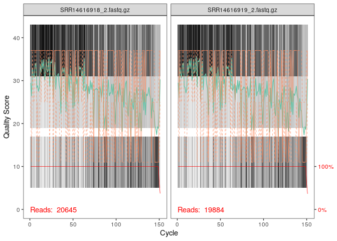<!-- -->

``` r
plotQualityProfile(fnFs[1:2])
```

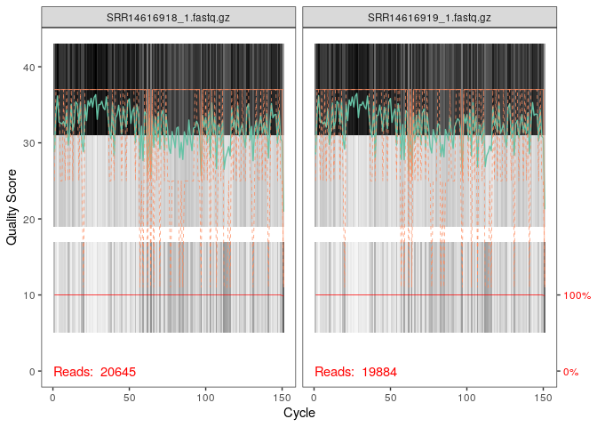<!-- -->

\#Filter and trim

``` r
filtFs <- file.path(path, "filtered", paste0(sample.names, "_F_filt.fastq.gz"))
filtRs <- file.path(path, "filtered", paste0(sample.names, "_R_filt.fastq.gz"))
names(filtFs) <- sample.names
names(filtRs) <- sample.names
```

\#etape de filtration de qualité

``` r
out <- filterAndTrim(fwd = fnFs, filt = filtFs, 
  rev = fnRs, filt.rev = filtRs, 
              maxN=0, maxEE=c(2,2), truncQ=2, rm.phix=TRUE, trimLeft=c(18,18), truncLen=c(150,140),
              compress=TRUE, multithread=TRUE)
head(out)
```

    ##                        reads.in reads.out
    ## SRR14616918_1.fastq.gz    20645      5138
    ## SRR14616919_1.fastq.gz    19884      5055
    ## SRR14616920_1.fastq.gz    11289      2948
    ## SRR14616921_1.fastq.gz     6970       734
    ## SRR14616922_1.fastq.gz    22738      3694
    ## SRR14616923_1.fastq.gz    21141      1607

``` r
#on va pas en dessous de 250
#il faut pas couper trop court pour pouvoir avoir une partie commune pour l'allignement (environ 20nt), ici on séquence la région V3 et V4 (300pb en tout) , on voit qu'on à des séquences de 150 nt en forward et 150nt en reverse 
#truncLen veut dire qu'on coupe à 150 et 140 (déterminé jusqu'à où le score de qualité est acceptable ) 150 sur le R1=forward et 140 sur le R2=reverse, faut bien regarder la longueur des fragments pour garder une superposition des deux lors de l'alignement (overlap) si on coupe trop court on en aura pas 
#maxN=0 quand séquenceur sait pas quelle pb c'est il met un N, donc on dit que si il y a au moins 1 N dans la seq on l'enlève car sera de mauvaise qualité 
#truncQ : a chaque fois que le long d'une sequence on voit apparaitre un score de qualié qui est inférieur à Q20 il coupe la séquence à ce niveau
#Trimleft : enlever les amorces à gauches (50 premiers nucléotides pour le forward et 55 premiers nucléotides pour le reverse)
#filter and trim : fonction qui permet de faire la filtration quelité des séquences 
#obtient read.in : nbr de séquences qu'il avait avant et read.out : nbr de séquences qu'il obtient après les avoir filtré
```

\#model d’erreur

``` r
errFs <- learnErrors(filtFs, multithread=TRUE)
```

    ## 29793060 total bases in 225705 reads from 61 samples will be used for learning the error rates.

``` r
errRs <- learnErrors(filtRs, multithread=TRUE)
```

    ## 27536010 total bases in 225705 reads from 61 samples will be used for learning the error rates.

``` r
plotErrors(errFs, nominalQ=TRUE)
```

    ## Warning: Transformation introduced infinite values in continuous y-axis
    ## Transformation introduced infinite values in continuous y-axis

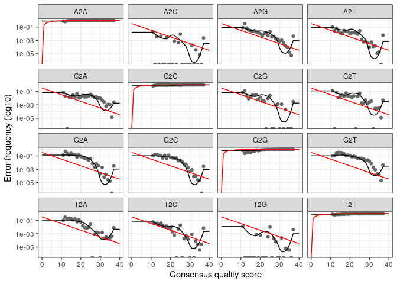<!-- -->

``` r
plotErrors(errRs, nominalQ=TRUE)
```

    ## Warning: Transformation introduced infinite values in continuous y-axis
    ## Transformation introduced infinite values in continuous y-axis

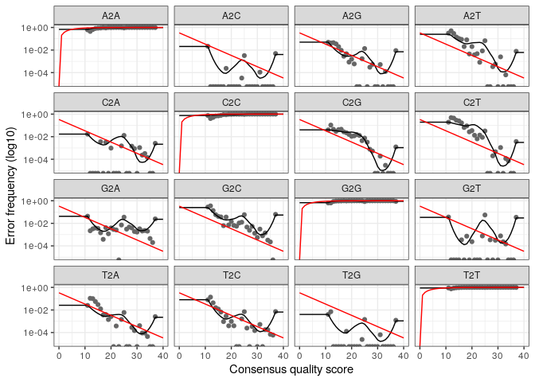<!-- -->

\#corriger les erreurs

``` r
dadaFs <- dada(filtFs, err=errFs, multithread=TRUE)
```

    ## Sample 1 - 5138 reads in 775 unique sequences.
    ## Sample 2 - 5055 reads in 693 unique sequences.
    ## Sample 3 - 2948 reads in 534 unique sequences.
    ## Sample 4 - 734 reads in 230 unique sequences.
    ## Sample 5 - 3694 reads in 647 unique sequences.
    ## Sample 6 - 1607 reads in 801 unique sequences.
    ## Sample 7 - 1975 reads in 1584 unique sequences.
    ## Sample 8 - 2167 reads in 694 unique sequences.
    ## Sample 9 - 4844 reads in 803 unique sequences.
    ## Sample 10 - 3766 reads in 928 unique sequences.
    ## Sample 11 - 1628 reads in 1271 unique sequences.
    ## Sample 12 - 2755 reads in 644 unique sequences.
    ## Sample 13 - 4019 reads in 753 unique sequences.
    ## Sample 14 - 5600 reads in 1122 unique sequences.
    ## Sample 15 - 2714 reads in 890 unique sequences.
    ## Sample 16 - 4610 reads in 731 unique sequences.
    ## Sample 17 - 828 reads in 721 unique sequences.
    ## Sample 18 - 2865 reads in 779 unique sequences.
    ## Sample 19 - 940 reads in 757 unique sequences.
    ## Sample 20 - 2133 reads in 449 unique sequences.
    ## Sample 21 - 2972 reads in 1254 unique sequences.
    ## Sample 22 - 1772 reads in 1501 unique sequences.
    ## Sample 23 - 1220 reads in 421 unique sequences.
    ## Sample 24 - 741 reads in 643 unique sequences.
    ## Sample 25 - 3489 reads in 1018 unique sequences.
    ## Sample 26 - 1017 reads in 534 unique sequences.
    ## Sample 27 - 4645 reads in 634 unique sequences.
    ## Sample 28 - 663 reads in 636 unique sequences.
    ## Sample 29 - 3081 reads in 1204 unique sequences.
    ## Sample 30 - 4148 reads in 1213 unique sequences.
    ## Sample 31 - 3172 reads in 872 unique sequences.
    ## Sample 32 - 1049 reads in 757 unique sequences.
    ## Sample 33 - 4300 reads in 1133 unique sequences.
    ## Sample 34 - 1770 reads in 1270 unique sequences.
    ## Sample 35 - 3450 reads in 787 unique sequences.
    ## Sample 36 - 3466 reads in 1043 unique sequences.
    ## Sample 37 - 1019 reads in 873 unique sequences.
    ## Sample 38 - 3086 reads in 537 unique sequences.
    ## Sample 39 - 5096 reads in 1304 unique sequences.
    ## Sample 40 - 2828 reads in 2007 unique sequences.
    ## Sample 41 - 1410 reads in 585 unique sequences.
    ## Sample 42 - 4663 reads in 730 unique sequences.
    ## Sample 43 - 2503 reads in 497 unique sequences.
    ## Sample 44 - 5031 reads in 851 unique sequences.
    ## Sample 45 - 6534 reads in 1326 unique sequences.
    ## Sample 46 - 9132 reads in 1357 unique sequences.
    ## Sample 47 - 7188 reads in 1045 unique sequences.
    ## Sample 48 - 6438 reads in 1094 unique sequences.
    ## Sample 49 - 5419 reads in 691 unique sequences.
    ## Sample 50 - 4410 reads in 1135 unique sequences.
    ## Sample 51 - 6456 reads in 1048 unique sequences.
    ## Sample 52 - 6823 reads in 1091 unique sequences.
    ## Sample 53 - 5704 reads in 922 unique sequences.
    ## Sample 54 - 3214 reads in 789 unique sequences.
    ## Sample 55 - 8016 reads in 1232 unique sequences.
    ## Sample 56 - 3659 reads in 656 unique sequences.
    ## Sample 57 - 7729 reads in 1302 unique sequences.
    ## Sample 58 - 4934 reads in 756 unique sequences.
    ## Sample 59 - 6332 reads in 920 unique sequences.
    ## Sample 60 - 2075 reads in 420 unique sequences.
    ## Sample 61 - 5031 reads in 785 unique sequences.

``` r
dadaRs <- dada(filtRs, err=errRs, multithread=TRUE)
```

    ## Sample 1 - 5138 reads in 3936 unique sequences.
    ## Sample 2 - 5055 reads in 3841 unique sequences.
    ## Sample 3 - 2948 reads in 2363 unique sequences.
    ## Sample 4 - 734 reads in 684 unique sequences.
    ## Sample 5 - 3694 reads in 2923 unique sequences.
    ## Sample 6 - 1607 reads in 1501 unique sequences.
    ## Sample 7 - 1975 reads in 1937 unique sequences.
    ## Sample 8 - 2167 reads in 1912 unique sequences.
    ## Sample 9 - 4844 reads in 3605 unique sequences.
    ## Sample 10 - 3766 reads in 3064 unique sequences.
    ## Sample 11 - 1628 reads in 1610 unique sequences.
    ## Sample 12 - 2755 reads in 2330 unique sequences.
    ## Sample 13 - 4019 reads in 3117 unique sequences.
    ## Sample 14 - 5600 reads in 4350 unique sequences.
    ## Sample 15 - 2714 reads in 2334 unique sequences.
    ## Sample 16 - 4610 reads in 3544 unique sequences.
    ## Sample 17 - 828 reads in 826 unique sequences.
    ## Sample 18 - 2865 reads in 2412 unique sequences.
    ## Sample 19 - 940 reads in 931 unique sequences.
    ## Sample 20 - 2133 reads in 1719 unique sequences.
    ## Sample 21 - 2972 reads in 2662 unique sequences.
    ## Sample 22 - 1772 reads in 1757 unique sequences.
    ## Sample 23 - 1220 reads in 1112 unique sequences.
    ## Sample 24 - 741 reads in 736 unique sequences.
    ## Sample 25 - 3489 reads in 2994 unique sequences.
    ## Sample 26 - 1017 reads in 970 unique sequences.
    ## Sample 27 - 4645 reads in 3482 unique sequences.
    ## Sample 28 - 663 reads in 659 unique sequences.
    ## Sample 29 - 3081 reads in 2654 unique sequences.
    ## Sample 30 - 4148 reads in 3316 unique sequences.
    ## Sample 31 - 3172 reads in 2697 unique sequences.
    ## Sample 32 - 1049 reads in 1025 unique sequences.
    ## Sample 33 - 4300 reads in 3725 unique sequences.
    ## Sample 34 - 1770 reads in 1664 unique sequences.
    ## Sample 35 - 3450 reads in 2807 unique sequences.
    ## Sample 36 - 3466 reads in 2964 unique sequences.
    ## Sample 37 - 1019 reads in 1016 unique sequences.
    ## Sample 38 - 3086 reads in 2471 unique sequences.
    ## Sample 39 - 5096 reads in 4277 unique sequences.
    ## Sample 40 - 2828 reads in 2770 unique sequences.
    ## Sample 41 - 1410 reads in 1284 unique sequences.
    ## Sample 42 - 4663 reads in 3585 unique sequences.
    ## Sample 43 - 2503 reads in 2002 unique sequences.
    ## Sample 44 - 5031 reads in 3698 unique sequences.
    ## Sample 45 - 6534 reads in 5132 unique sequences.
    ## Sample 46 - 9132 reads in 6389 unique sequences.
    ## Sample 47 - 7188 reads in 5258 unique sequences.
    ## Sample 48 - 6438 reads in 4690 unique sequences.
    ## Sample 49 - 5419 reads in 4102 unique sequences.
    ## Sample 50 - 4410 reads in 3542 unique sequences.
    ## Sample 51 - 6456 reads in 4705 unique sequences.
    ## Sample 52 - 6823 reads in 4959 unique sequences.
    ## Sample 53 - 5704 reads in 4267 unique sequences.
    ## Sample 54 - 3214 reads in 2626 unique sequences.
    ## Sample 55 - 8016 reads in 5776 unique sequences.
    ## Sample 56 - 3659 reads in 2835 unique sequences.
    ## Sample 57 - 7729 reads in 5569 unique sequences.
    ## Sample 58 - 4934 reads in 3795 unique sequences.
    ## Sample 59 - 6332 reads in 4741 unique sequences.
    ## Sample 60 - 2075 reads in 1734 unique sequences.
    ## Sample 61 - 5031 reads in 3872 unique sequences.

\#faire l’allignement des R1 et R2

``` r
mergers <- mergePairs(dadaFs, filtFs, dadaRs, filtRs, justConcatenate=TRUE, verbose=TRUE)
```

    ## 5104 paired-reads (in 9 unique pairings) successfully merged out of 5104 (in 9 pairings) input.

    ## 5034 paired-reads (in 10 unique pairings) successfully merged out of 5034 (in 10 pairings) input.

    ## 2917 paired-reads (in 11 unique pairings) successfully merged out of 2917 (in 11 pairings) input.

    ## 723 paired-reads (in 9 unique pairings) successfully merged out of 723 (in 9 pairings) input.

    ## 3672 paired-reads (in 19 unique pairings) successfully merged out of 3672 (in 19 pairings) input.

    ## 1382 paired-reads (in 50 unique pairings) successfully merged out of 1382 (in 50 pairings) input.

    ## 925 paired-reads (in 62 unique pairings) successfully merged out of 925 (in 62 pairings) input.

    ## 2118 paired-reads (in 31 unique pairings) successfully merged out of 2118 (in 31 pairings) input.

    ## 4790 paired-reads (in 23 unique pairings) successfully merged out of 4790 (in 23 pairings) input.

    ## 3632 paired-reads (in 27 unique pairings) successfully merged out of 3632 (in 27 pairings) input.

    ## 511 paired-reads (in 32 unique pairings) successfully merged out of 511 (in 32 pairings) input.

    ## 2669 paired-reads (in 25 unique pairings) successfully merged out of 2669 (in 25 pairings) input.

    ## 3968 paired-reads (in 15 unique pairings) successfully merged out of 3968 (in 15 pairings) input.

    ## 5537 paired-reads (in 33 unique pairings) successfully merged out of 5537 (in 33 pairings) input.

    ## 2603 paired-reads (in 32 unique pairings) successfully merged out of 2603 (in 32 pairings) input.

    ## 4574 paired-reads (in 13 unique pairings) successfully merged out of 4574 (in 13 pairings) input.

    ## 26 paired-reads (in 7 unique pairings) successfully merged out of 26 (in 7 pairings) input.

    ## 2829 paired-reads (in 36 unique pairings) successfully merged out of 2829 (in 36 pairings) input.

    ## 167 paired-reads (in 3 unique pairings) successfully merged out of 167 (in 3 pairings) input.

    ## 2099 paired-reads (in 13 unique pairings) successfully merged out of 2099 (in 13 pairings) input.

    ## 2799 paired-reads (in 74 unique pairings) successfully merged out of 2799 (in 74 pairings) input.

    ## 549 paired-reads (in 46 unique pairings) successfully merged out of 549 (in 46 pairings) input.

    ## 1179 paired-reads (in 23 unique pairings) successfully merged out of 1179 (in 23 pairings) input.

    ## 65 paired-reads (in 6 unique pairings) successfully merged out of 65 (in 6 pairings) input.

    ## 3428 paired-reads (in 48 unique pairings) successfully merged out of 3428 (in 48 pairings) input.

    ## 914 paired-reads (in 27 unique pairings) successfully merged out of 914 (in 27 pairings) input.

    ## 4624 paired-reads (in 12 unique pairings) successfully merged out of 4624 (in 12 pairings) input.

    ## 104 paired-reads (in 9 unique pairings) successfully merged out of 104 (in 9 pairings) input.

    ## 2950 paired-reads (in 61 unique pairings) successfully merged out of 2950 (in 61 pairings) input.

    ## 4101 paired-reads (in 62 unique pairings) successfully merged out of 4101 (in 62 pairings) input.

    ## 3035 paired-reads (in 50 unique pairings) successfully merged out of 3035 (in 50 pairings) input.

    ## 673 paired-reads (in 36 unique pairings) successfully merged out of 673 (in 36 pairings) input.

    ## 4055 paired-reads (in 37 unique pairings) successfully merged out of 4055 (in 37 pairings) input.

    ## 1360 paired-reads (in 70 unique pairings) successfully merged out of 1360 (in 70 pairings) input.

    ## 3415 paired-reads (in 28 unique pairings) successfully merged out of 3415 (in 28 pairings) input.

    ## 3395 paired-reads (in 50 unique pairings) successfully merged out of 3395 (in 50 pairings) input.

    ## 252 paired-reads (in 12 unique pairings) successfully merged out of 252 (in 12 pairings) input.

    ## 3068 paired-reads (in 11 unique pairings) successfully merged out of 3068 (in 11 pairings) input.

    ## 4991 paired-reads (in 31 unique pairings) successfully merged out of 4991 (in 31 pairings) input.

    ## 1459 paired-reads (in 85 unique pairings) successfully merged out of 1459 (in 85 pairings) input.

    ## 1324 paired-reads (in 15 unique pairings) successfully merged out of 1324 (in 15 pairings) input.

    ## 4575 paired-reads (in 19 unique pairings) successfully merged out of 4575 (in 19 pairings) input.

    ## 2469 paired-reads (in 9 unique pairings) successfully merged out of 2469 (in 9 pairings) input.

    ## 4938 paired-reads (in 24 unique pairings) successfully merged out of 4938 (in 24 pairings) input.

    ## 6409 paired-reads (in 38 unique pairings) successfully merged out of 6409 (in 38 pairings) input.

    ## 9103 paired-reads (in 38 unique pairings) successfully merged out of 9103 (in 38 pairings) input.

    ## 7169 paired-reads (in 26 unique pairings) successfully merged out of 7169 (in 26 pairings) input.

    ## 6393 paired-reads (in 30 unique pairings) successfully merged out of 6393 (in 30 pairings) input.

    ## 5383 paired-reads (in 13 unique pairings) successfully merged out of 5383 (in 13 pairings) input.

    ## 4324 paired-reads (in 40 unique pairings) successfully merged out of 4324 (in 40 pairings) input.

    ## 6369 paired-reads (in 32 unique pairings) successfully merged out of 6369 (in 32 pairings) input.

    ## 6761 paired-reads (in 23 unique pairings) successfully merged out of 6761 (in 23 pairings) input.

    ## 5683 paired-reads (in 19 unique pairings) successfully merged out of 5683 (in 19 pairings) input.

    ## 3164 paired-reads (in 18 unique pairings) successfully merged out of 3164 (in 18 pairings) input.

    ## 8000 paired-reads (in 42 unique pairings) successfully merged out of 8000 (in 42 pairings) input.

    ## 3654 paired-reads (in 11 unique pairings) successfully merged out of 3654 (in 11 pairings) input.

    ## 7622 paired-reads (in 29 unique pairings) successfully merged out of 7622 (in 29 pairings) input.

    ## 4901 paired-reads (in 23 unique pairings) successfully merged out of 4901 (in 23 pairings) input.

    ## 6272 paired-reads (in 24 unique pairings) successfully merged out of 6272 (in 24 pairings) input.

    ## 2056 paired-reads (in 13 unique pairings) successfully merged out of 2056 (in 13 pairings) input.

    ## 5000 paired-reads (in 15 unique pairings) successfully merged out of 5000 (in 15 pairings) input.

``` r
head(mergers[[1]])
```

    ##       sequence abundance forward reverse nmatch nmismatch nindel prefer accept
    ## 1 GGGGAATA....      2535       1       1      0         0      0     NA   TRUE
    ## 2 GGGGAATA....      1193       2       1      0         0      0     NA   TRUE
    ## 3 GGGGAATA....       616       3       1      0         0      0     NA   TRUE
    ## 4 GGGGAATA....       263       4       1      0         0      0     NA   TRUE
    ## 5 GGGGAATA....       251       5       1      0         0      0     NA   TRUE
    ## 6 GGGGAATA....       127       6       1      0         0      0     NA   TRUE

``` r
#avec la méthode sans justConcatenate aucun paired-reads n'est formé 
#cette fonction permet de faire en sorte que le forward et le reverse soient concaténés en laissant un spacer (de 10 Ns) entre les deux 
```

\#créer table d’observation des séquences :

``` r
seqtabAll <- makeSequenceTable(mergers[!grepl("Mock", names(mergers))])
table(nchar(getSequences(seqtabAll)))
```

    ## 
    ##  264 
    ## 1040

``` r
#on importe toutes les séquences de la table sauf celle Mock (car est une séquence artificielle introduite pour vérifier que ça marche)
#deuxième ligne = nombre de caractères 
#troisième ligne = nombre de séquences qui ont ce nombre de caractères 
#permet de vérifier que l'allignement est bien fait
```

\#enlever les chimères = séquences avec un bout de séquence d’une
bactérie et un bout d’une autre bactérie , se produit pendant la PCR
lorsque l’ARNpol se décroche avant la fin

``` r
seqtab.nochim <- removeBimeraDenovo(seqtabAll, method="consensus", multithread=TRUE, verbose=TRUE)
```

    ## Identified 526 bimeras out of 1040 input sequences.

``` r
dim(seqtab.nochim)
```

    ## [1]  61 514

``` r
sum(seqtab.nochim)/sum(seqtabAll)
```

    ## [1] 0.9626052

\#Track reads through the pipeline

``` r
getN <- function(x) sum(getUniques(x))
track <- cbind(out, sapply(dadaFs, getN), sapply(dadaRs, getN), sapply(mergers, getN), rowSums(seqtab.nochim))
colnames(track) <- c("input", "filtered", "denoisedF", "denoisedR", "merged", "nonchim")
rownames(track) <- sample.names
head(track)
```

    ##             input filtered denoisedF denoisedR merged nonchim
    ## SRR14616918 20645     5138      5123      5104   5104    5049
    ## SRR14616919 19884     5055      5043      5037   5034    5029
    ## SRR14616920 11289     2948      2922      2933   2917    2916
    ## SRR14616921  6970      734       729       727    723     723
    ## SRR14616922 22738     3694      3676      3681   3672    3659
    ## SRR14616923 21141     1607      1562      1400   1382    1230

\#annotation taxonomique

``` r
#assigner taxo
taxa <- assignTaxonomy(seqtab.nochim, "silva_nr99_v138.1_train_set.fa.gz?download=1", multithread=TRUE)
```

``` r
taxa.print <- taxa 
rownames(taxa.print) <- NULL
head(taxa.print)
```

    ##      Kingdom    Phylum           Class                 Order             
    ## [1,] "Bacteria" "Proteobacteria" "Gammaproteobacteria" "Enterobacterales"
    ## [2,] "Bacteria" "Proteobacteria" "Gammaproteobacteria" "Enterobacterales"
    ## [3,] "Bacteria" "Proteobacteria" "Gammaproteobacteria" "Enterobacterales"
    ## [4,] "Bacteria" "Proteobacteria" "Gammaproteobacteria" "Enterobacterales"
    ## [5,] "Bacteria" "Proteobacteria" "Gammaproteobacteria" "Enterobacterales"
    ## [6,] "Bacteria" "Proteobacteria" "Gammaproteobacteria" "Enterobacterales"
    ##      Family         Genus   
    ## [1,] "Vibrionaceae" "Vibrio"
    ## [2,] "Vibrionaceae" "Vibrio"
    ## [3,] "Vibrionaceae" "Vibrio"
    ## [4,] "Vibrionaceae" "Vibrio"
    ## [5,] "Vibrionaceae" "Vibrio"
    ## [6,] "Vibrionaceae" "Vibrio"

``` r
dna <- DNAStringSet(getSequences(seqtab.nochim)) 
load("SILVA_SSU_r138_2019.RData") 
ids <- IdTaxa(dna, trainingSet, strand="top", processors=NULL, verbose=FALSE) 
ranks <- c("domain", "phylum", "class", "order", "family", "genus", "species") 
taxid <- t(sapply(ids, function(x) {
        m <- match(ranks, x$rank)
        taxa <- x$taxon[m]
        taxa[startsWith(taxa, "unclassified_")] <- NA
        taxa
}))
colnames(taxid) <- ranks; rownames(taxid) <- getSequences(seqtab.nochim)
```

``` r
theme_set(theme_bw())
```

\#samdf ALEX

``` r
library(stringr)
```

``` r
theme_set(theme_bw())
```

``` r
samples.out <- rownames(seqtab.nochim)
code_name <- "XXXXXX"
code_name[samples.out == "SRR14616918"] <- "VB1-10"
code_name[samples.out == "SRR14616919"] <- "VB1-9"
code_name[samples.out == "SRR14616920"] <- "VB1-8"
code_name[samples.out == "SRR14616921"] <- "WSWcontrol"
code_name[samples.out == "SRR14616922"] <- "VB1-7"
code_name[samples.out == "SRR14616923"] <- "WS9W"
code_name[samples.out == "SRR14616924"] <- "WS9K"
code_name[samples.out == "SRR14616925"] <- "WS9"
code_name[samples.out == "SRR14616926"] <- "WWS9"
code_name[samples.out == "SRR14616927"] <- "WS8W"
code_name[samples.out == "SRR14616928"] <- "WS8K"
code_name[samples.out == "SRR14616929"] <- "WS8"
code_name[samples.out == "SRR14616930"] <- "WWS8"
code_name[samples.out == "SRR14616931"] <- "WWS7"
code_name[samples.out == "SRR14616932"] <- "WS6W"
code_name[samples.out == "SRR14616933"] <- "VB1-6"
code_name[samples.out == "SRR14616934"] <- "WS6K"
code_name[samples.out == "SRR14616935"] <- "WS6"
code_name[samples.out == "SRR14616936"] <- "DWWS6"
code_name[samples.out == "SRR14616937"] <- "WWS6"
code_name[samples.out == "SRR14616938"] <- "WS5W"
code_name[samples.out == "SRR14616939"] <- "WS5K"
code_name[samples.out == "SRR14616940"] <- "WS5"
code_name[samples.out == "SRR14616941"] <- "DWWS5"
code_name[samples.out == "SRR14616942"] <- "WWS5"
code_name[samples.out == "SRR14616943"] <- "WS3W"
code_name[samples.out == "SRR14616944"] <- "VB1-5"
code_name[samples.out == "SRR14616945"] <- "WS3K"
code_name[samples.out == "SRR14616946"] <- "WS3"
code_name[samples.out == "SRR14616947"] <- "WWS3"
code_name[samples.out == "SRR14616948"] <- "WS2W"
code_name[samples.out == "SRR14616949"] <- "WS2K"
code_name[samples.out == "SRR14616950"] <- "WS2"
code_name[samples.out == "SRR14616951"] <- "DWWS2"
code_name[samples.out == "SRR14616952"] <- "WWS2"
code_name[samples.out == "SRR14616953"] <- "WS1W"
code_name[samples.out == "SRR14616954"] <- "WS1K"
code_name[samples.out == "SRR14616955"] <- "VB1-4"
code_name[samples.out == "SRR14616956"] <- "WS1"
code_name[samples.out == "SRR14616957"] <- "DWWS1"
code_name[samples.out == "SRR14616958"] <- "WWS1"
code_name[samples.out == "SRR14616959"] <- "VB2-27"
code_name[samples.out == "SRR14616960"] <- "VB2-26"
code_name[samples.out == "SRR14616961"] <- "VB2-25"
code_name[samples.out == "SRR14616962"] <- "VB2-24"
code_name[samples.out == "SRR14616963"] <- "VB2-23"
code_name[samples.out == "SRR14616964"] <- "VB2-22"
code_name[samples.out == "SRR14616965"] <- "VB2-21"
code_name[samples.out == "SRR14616966"] <- "VB1-3"
code_name[samples.out == "SRR14616967"] <- "VB-20"
code_name[samples.out == "SRR14616968"] <- "VB2-19"
code_name[samples.out == "SRR14616969"] <- "VB2-18"
code_name[samples.out == "SRR14616970"] <- "VB2-17"
code_name[samples.out == "SRR14616971"] <- "VB2-16"
code_name[samples.out == "SRR14616972"] <- "VB2-15"
code_name[samples.out == "SRR14616973"] <- "VB1-14"
code_name[samples.out == "SRR14616974"] <- "VB1-13"
code_name[samples.out == "SRR14616975"] <- "VB1-12"
code_name[samples.out == "SRR14616976"] <- "VB1-11"
code_name[samples.out == "SRR14616977"] <- "VB1-2"
code_name[samples.out == "SRR14616978"] <- "VB1-1"
Samples <- "Fish"
Samples[1:61]<- "Fish"
Samples[code_name == "WSWcontrol"] <- "Sediment"
Samples[code_name == "WS9W"] <- "Sediment EPL"
Samples[code_name == "WS9K"] <- "Direct Sediment"
Samples[code_name == "WS9"] <- "Sediment EP"
Samples[code_name == "WWS9"] <- "Enrichie Freshwater"
Samples[code_name == "WS8W"] <- "Sediment EPL"
Samples[code_name == "WS8K"] <- "Direct Sediment"
Samples[code_name == "WS8"] <- "Sediment EP"
Samples[code_name == "WWS8"] <- "Enrichie Freshwater"
Samples[code_name == "WWS7"] <- "Enrichie Freshwater"
Samples[code_name == "WS6W"] <- "Sediment EPL"
Samples[code_name == "WS6K"] <- "Direct Sediment"
Samples[code_name == "WS6"] <- "Sediment EP"
Samples[code_name == "DWWS6"] <- "Direct Freshwater"
Samples[code_name == "WWS6"] <- "Enrichie Freshwater"
Samples[code_name == "WS5W"] <- "Sediment EPL"
Samples[code_name == "WS5K"] <- "Direct Sediment"
Samples[code_name == "WS5"] <- "Sediment EP"
Samples[code_name == "DWWS5"] <- "Direct Freshwater"
Samples[code_name == "WWS5"] <- "Enrichie Freshwater"
Samples[code_name == "WS3W"] <- "Sediment EPL"
Samples[code_name == "WS3K"] <- "Direct Sediment"
Samples[code_name == "WS3"] <- "Sediment EP"
Samples[code_name == "WWS3"] <- "Enrichie Freshwater"
Samples[code_name == "WS2W"] <- "Sediment EPL"
Samples[code_name == "WS2K"] <- "Direct Sediment"
Samples[code_name == "WS2"] <- "Sediment EP"
Samples[code_name == "DWWS2"] <- "Direct Freshwater"
Samples[code_name == "WWS2"] <- "Enrichie Freshwater"
Samples[code_name == "WS1W"] <- "Sediment EPL"
Samples[code_name == "WS1K"] <- "Direct Sediment"
Samples[code_name == "WS1"] <- "Sediment EP"
Samples[code_name == "DWWS1"] <- "Direct Freshwater"
Samples[code_name == "WWS1"] <- "Enrichie Freshwater"
#Localisation
Localisation <- "lake water"
Localisation[1:61] <- "lake water"
Localisation[str_detect(code_name, pattern = "WS1")] <- "Edremit"
Localisation[str_detect(code_name, pattern = "WS2")] <- "Ergil-1"
Localisation[str_detect(code_name, pattern = "WS3")] <- "Ergil-2"
Localisation[str_detect(code_name, pattern = "WS5")] <- "Gevaş"
Localisation[str_detect(code_name, pattern = "WS6")] <- "Gevaş-Tatvan"
Localisation[str_detect(code_name, pattern = "WS7")] <- "Gevaş-DSİ-1"
Localisation[str_detect(code_name, pattern = "WS8")] <- "Gevaş-DSİ-2"
Localisation[str_detect(code_name, pattern = "WS9")] <- "Akdamar"
Localisation[str_detect(code_name, pattern = "VB1")] <- "Edremit"
Localisation[str_detect(code_name, pattern = "VB2")] <- "Gevaş-İnköy"
#Temperatures
Temperature <- "6.1"
Temperature[1:61] <- "6.1"
Temperature[Localisation == "Ergil-1"] <- "9.2"
Temperature[Localisation == "Ergil-2"] <- "8.1"
Temperature[Localisation == "Gevaş"] <- "7.8"
Temperature[Localisation == "Gevaş-Tatvan"] <- "5.5"
Temperature[Localisation == "Gevaş-DSİ-1"] <- "5.5"
Temperature[Localisation == "Gevaş-DSİ-2"] <- "4.7"
Temperature[Localisation == "Akdamar"] <- "6.4"
Temperature[Localisation == "Gevaş-İnköy"] <- "?"
#profondeur
Profondeur <- "7-10"
Profondeur[1:61] <- "7-10"
Profondeur[Localisation == "Ergil-1"] <- "0-1"
Profondeur[Localisation == "Ergil-2"] <- "0-1"
Profondeur[Localisation == "Gevaş"] <- "7-10"
Profondeur[Localisation == "Gevaş-Tatvan"] <- "7-10"
Profondeur[Localisation == "Gevaş-DSİ-1"] <- "7-10"
Profondeur[Localisation == "Gevaş-DSİ-2"] <- "0-1"
Profondeur[Localisation == "Akdamar"] <- "0-1"
Profondeur[Localisation == "Gevaş-İnköy"] <- "?"
#oxygen
Oxygen <- "4"
Oxygen[1:61] <- "4"
Oxygen[Localisation == "Ergil-1"] <- "4.2"
Oxygen[Localisation == "Ergil-2"] <- "4.2"
Oxygen[Localisation == "Gevaş (pier)"] <- "4.1"
Oxygen[Localisation == "Gevaş"] <- "4.1"
Oxygen[Localisation == "Gevaş-Tatvan"] <- "4.1"
Oxygen[Localisation == "Gevaş-DSİ-1"] <- "4"
Oxygen[Localisation == "Gevaş-DSİ-2"] <- "4"
Oxygen[Localisation == "Akdamar"] <- "3.9"
Oxygen[Localisation == "Gevaş-İnköy"] <- "?"
#pH
pH <- "9.55"
pH[1:61] <- "9.55"
pH[Localisation == "Ergil-1"] <- "9.57"
pH[Localisation == "Ergil-2"] <- "7.90"
pH[Localisation == "Gevaş"] <- "9.38"
pH[Localisation == "Tatvan"] <- "9.56"
pH[Localisation == "Gevaş-DSİ-1"] <- "9.56"
pH[Localisation == "Gevaş-DSİ-2"] <- "9.56"
pH[Localisation == "Akdamar"] <- "9.56"
pH[Localisation == "Gevaş-İnköy"] <- "?"
samdf <- data.frame(code_name, Samples, Localisation, Temperature, Profondeur, Oxygen, pH) 
rownames(samdf) <- samples.out
print(samdf)
```

    ##              code_name             Samples Localisation Temperature Profondeur
    ## SRR14616918     VB1-10                Fish      Edremit         6.1       7-10
    ## SRR14616919      VB1-9                Fish      Edremit         6.1       7-10
    ## SRR14616920      VB1-8                Fish      Edremit         6.1       7-10
    ## SRR14616921 WSWcontrol            Sediment   lake water         6.1       7-10
    ## SRR14616922      VB1-7                Fish      Edremit         6.1       7-10
    ## SRR14616923       WS9W        Sediment EPL      Akdamar         6.4        0-1
    ## SRR14616924       WS9K     Direct Sediment      Akdamar         6.4        0-1
    ## SRR14616925        WS9         Sediment EP      Akdamar         6.4        0-1
    ## SRR14616926       WWS9 Enrichie Freshwater      Akdamar         6.4        0-1
    ## SRR14616927       WS8W        Sediment EPL  Gevaş-DSİ-2         4.7        0-1
    ## SRR14616928       WS8K     Direct Sediment  Gevaş-DSİ-2         4.7        0-1
    ## SRR14616929        WS8         Sediment EP  Gevaş-DSİ-2         4.7        0-1
    ## SRR14616930       WWS8 Enrichie Freshwater  Gevaş-DSİ-2         4.7        0-1
    ## SRR14616931       WWS7 Enrichie Freshwater  Gevaş-DSİ-1         5.5       7-10
    ## SRR14616932       WS6W        Sediment EPL Gevaş-Tatvan         5.5       7-10
    ## SRR14616933      VB1-6                Fish      Edremit         6.1       7-10
    ## SRR14616934       WS6K     Direct Sediment Gevaş-Tatvan         5.5       7-10
    ## SRR14616935        WS6         Sediment EP Gevaş-Tatvan         5.5       7-10
    ## SRR14616936      DWWS6   Direct Freshwater Gevaş-Tatvan         5.5       7-10
    ## SRR14616937       WWS6 Enrichie Freshwater Gevaş-Tatvan         5.5       7-10
    ## SRR14616938       WS5W        Sediment EPL        Gevaş         7.8       7-10
    ## SRR14616939       WS5K     Direct Sediment        Gevaş         7.8       7-10
    ## SRR14616940        WS5         Sediment EP        Gevaş         7.8       7-10
    ## SRR14616941      DWWS5   Direct Freshwater        Gevaş         7.8       7-10
    ## SRR14616942       WWS5 Enrichie Freshwater        Gevaş         7.8       7-10
    ## SRR14616943       WS3W        Sediment EPL      Ergil-2         8.1        0-1
    ## SRR14616944      VB1-5                Fish      Edremit         6.1       7-10
    ## SRR14616945       WS3K     Direct Sediment      Ergil-2         8.1        0-1
    ## SRR14616946        WS3         Sediment EP      Ergil-2         8.1        0-1
    ## SRR14616947       WWS3 Enrichie Freshwater      Ergil-2         8.1        0-1
    ## SRR14616948       WS2W        Sediment EPL      Ergil-1         9.2        0-1
    ## SRR14616949       WS2K     Direct Sediment      Ergil-1         9.2        0-1
    ## SRR14616950        WS2         Sediment EP      Ergil-1         9.2        0-1
    ## SRR14616951      DWWS2   Direct Freshwater      Ergil-1         9.2        0-1
    ## SRR14616952       WWS2 Enrichie Freshwater      Ergil-1         9.2        0-1
    ## SRR14616953       WS1W        Sediment EPL      Edremit         6.1       7-10
    ## SRR14616954       WS1K     Direct Sediment      Edremit         6.1       7-10
    ## SRR14616955      VB1-4                Fish      Edremit         6.1       7-10
    ## SRR14616956        WS1         Sediment EP      Edremit         6.1       7-10
    ## SRR14616957      DWWS1   Direct Freshwater      Edremit         6.1       7-10
    ## SRR14616958       WWS1 Enrichie Freshwater      Edremit         6.1       7-10
    ## SRR14616959     VB2-27                Fish  Gevaş-İnköy           ?          ?
    ## SRR14616960     VB2-26                Fish  Gevaş-İnköy           ?          ?
    ## SRR14616961     VB2-25                Fish  Gevaş-İnköy           ?          ?
    ## SRR14616962     VB2-24                Fish  Gevaş-İnköy           ?          ?
    ## SRR14616963     VB2-23                Fish  Gevaş-İnköy           ?          ?
    ## SRR14616964     VB2-22                Fish  Gevaş-İnköy           ?          ?
    ## SRR14616965     VB2-21                Fish  Gevaş-İnköy           ?          ?
    ## SRR14616966      VB1-3                Fish      Edremit         6.1       7-10
    ## SRR14616967      VB-20                Fish   lake water         6.1       7-10
    ## SRR14616968     VB2-19                Fish  Gevaş-İnköy           ?          ?
    ## SRR14616969     VB2-18                Fish  Gevaş-İnköy           ?          ?
    ## SRR14616970     VB2-17                Fish  Gevaş-İnköy           ?          ?
    ## SRR14616971     VB2-16                Fish  Gevaş-İnköy           ?          ?
    ## SRR14616972     VB2-15                Fish  Gevaş-İnköy           ?          ?
    ## SRR14616973     VB1-14                Fish      Edremit         6.1       7-10
    ## SRR14616974     VB1-13                Fish      Edremit         6.1       7-10
    ## SRR14616975     VB1-12                Fish      Edremit         6.1       7-10
    ## SRR14616976     VB1-11                Fish      Edremit         6.1       7-10
    ## SRR14616977      VB1-2                Fish      Edremit         6.1       7-10
    ## SRR14616978      VB1-1                Fish      Edremit         6.1       7-10
    ##             Oxygen   pH
    ## SRR14616918      4 9.55
    ## SRR14616919      4 9.55
    ## SRR14616920      4 9.55
    ## SRR14616921      4 9.55
    ## SRR14616922      4 9.55
    ## SRR14616923    3.9 9.56
    ## SRR14616924    3.9 9.56
    ## SRR14616925    3.9 9.56
    ## SRR14616926    3.9 9.56
    ## SRR14616927      4 9.56
    ## SRR14616928      4 9.56
    ## SRR14616929      4 9.56
    ## SRR14616930      4 9.56
    ## SRR14616931      4 9.56
    ## SRR14616932    4.1 9.55
    ## SRR14616933      4 9.55
    ## SRR14616934    4.1 9.55
    ## SRR14616935    4.1 9.55
    ## SRR14616936    4.1 9.55
    ## SRR14616937    4.1 9.55
    ## SRR14616938    4.1 9.38
    ## SRR14616939    4.1 9.38
    ## SRR14616940    4.1 9.38
    ## SRR14616941    4.1 9.38
    ## SRR14616942    4.1 9.38
    ## SRR14616943    4.2 7.90
    ## SRR14616944      4 9.55
    ## SRR14616945    4.2 7.90
    ## SRR14616946    4.2 7.90
    ## SRR14616947    4.2 7.90
    ## SRR14616948    4.2 9.57
    ## SRR14616949    4.2 9.57
    ## SRR14616950    4.2 9.57
    ## SRR14616951    4.2 9.57
    ## SRR14616952    4.2 9.57
    ## SRR14616953      4 9.55
    ## SRR14616954      4 9.55
    ## SRR14616955      4 9.55
    ## SRR14616956      4 9.55
    ## SRR14616957      4 9.55
    ## SRR14616958      4 9.55
    ## SRR14616959      ?    ?
    ## SRR14616960      ?    ?
    ## SRR14616961      ?    ?
    ## SRR14616962      ?    ?
    ## SRR14616963      ?    ?
    ## SRR14616964      ?    ?
    ## SRR14616965      ?    ?
    ## SRR14616966      4 9.55
    ## SRR14616967      4 9.55
    ## SRR14616968      ?    ?
    ## SRR14616969      ?    ?
    ## SRR14616970      ?    ?
    ## SRR14616971      ?    ?
    ## SRR14616972      ?    ?
    ## SRR14616973      4 9.55
    ## SRR14616974      4 9.55
    ## SRR14616975      4 9.55
    ## SRR14616976      4 9.55
    ## SRR14616977      4 9.55
    ## SRR14616978      4 9.55

``` r
ps <- phyloseq(otu_table(seqtab.nochim, taxa_are_rows=FALSE), 
               sample_data(samdf), 
               tax_table(taxa))
```

``` r
dna <- Biostrings::DNAStringSet(taxa_names(ps))
names(dna) <- taxa_names(ps)
ps <- merge_phyloseq(ps, dna)
taxa_names(ps) <- paste0("ASV", seq(ntaxa(ps)))
ps
```

    ## phyloseq-class experiment-level object
    ## otu_table()   OTU Table:         [ 514 taxa and 61 samples ]
    ## sample_data() Sample Data:       [ 61 samples by 7 sample variables ]
    ## tax_table()   Taxonomy Table:    [ 514 taxa by 6 taxonomic ranks ]
    ## refseq()      DNAStringSet:      [ 514 reference sequences ]

``` r
plot_richness(ps, x="Samples", measures="Shannon", color="Samples")
```

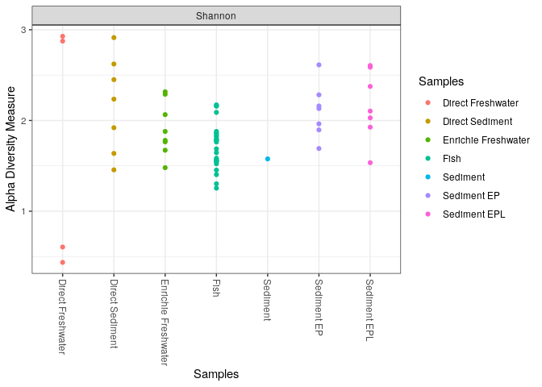<!-- -->

\#Extrait de l’article : Alpha diversity measuring richness of bacterial
communities of lake was determined by Shannon diversity values. Directly
studied water and sediment samples showed higher diversity values for
Shannon diversity index than pre-enriched samples of both water and
sediment as well as pre-enriched fsh samples (see supplementary
information Table S1).

# Nos observations: nos résultats confirment les dires des auteurs, on observe effectivement une plus grande diversité alpha dans les sédiments et l’eau du Lac surtout pour les échantillons non enrichis

\#les auteurs n’ont pas réalisé de PCoA

\#PCoA pH

``` r
plot_ordination(ps.prop, ord.nmds.bray, color="Samples", title="Bray PCoA", shape="pH")
```

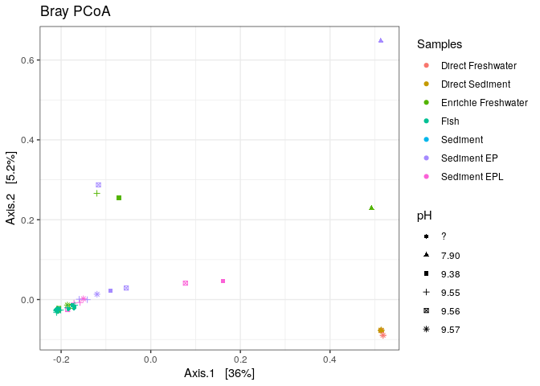<!-- --> \#en
ordination faire une pcoa et une CCA

``` r
ps.prop2 <- transform_sample_counts(ps, function(otu) otu/sum(otu))
ord.nmds.bray2 <- ordinate(ps.prop, method="PCoA", distance="jaccard")
```

\#PCoA Oxygen

``` r
plot_ordination(ps.prop2, ord.nmds.bray2, color="Samples", title="PCoA", shape="Oxygen")
```

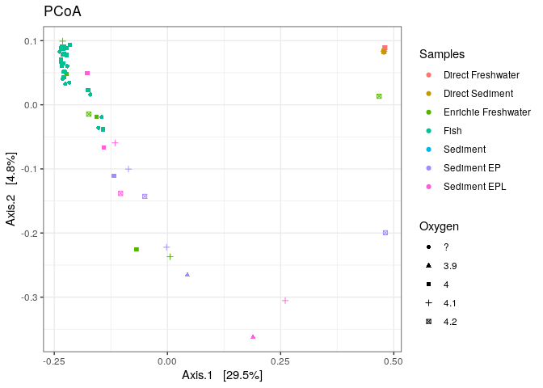<!-- -->

``` r
ps.prop3 <- transform_sample_counts(ps, function(otu) otu/sum(otu))
ord.coa.bray <- ordinate(ps.prop3, method="PCoA", distance="jaccard")
```

\#PCoA Temperature

``` r
plot_ordination(ps.prop3, ord.coa.bray, color="Samples", title="PCoA", shape="Temperature")
```

    ## Warning: The shape palette can deal with a maximum of 6 discrete values because
    ## more than 6 becomes difficult to discriminate; you have 8. Consider
    ## specifying shapes manually if you must have them.

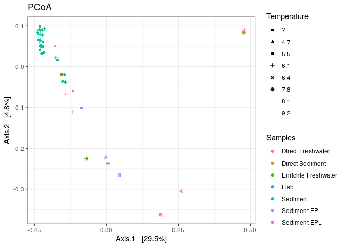<!-- -->

\#Regroupement en OTU au niveau Phylum

``` r
top20 <- names(sort(taxa_sums(ps), decreasing=TRUE))[1:20]
ps.top20 <- transform_sample_counts(ps, function(OTU) OTU/sum(OTU))
ps.top20 <- prune_taxa(top20, ps.top20)
plot_bar(ps.top20, x="code_name", fill="Phylum") + facet_wrap(~Samples, scales="free_x")
```

<!-- -->

\#Le classifieur n’est pas allé plus loin que le domaine pour les
échantillons directs d’eau et de sédiments. \#On remarque une très forte
dominance des portéobactéries dans tous nos échantillons et en
particulier dans ceux provenant des poissons. Dans les sédiments il y a
également une faible abondance de Fusobactéria et de Firmicutes,
celle-ci est plus importante dans les échantillons d’eau avec même
certaines échantillons dans lesquels elles sont plus abondantes que les
gammaproteobacteria (WS3). \#dans l’article, les fish samples sont
dominés par des protéobactéries et des firmicutes, cette dernière n’est
pas visibles sur nos analyses. Pour les échantillons de sédiments, ils
étaient divisés en deux catégories : les pré-enrichis avec de l’eau
peptonée et les pré-enrichis avec de l’eau peptonées suplémentés de
l’eau du lac. \#En accord avec nos observations, ces échantillons
sédimntaires contiennent des protéobactéries, des Firmicutes et des
Fusobacteriota pour ceux enrichis à l’eau peptonée. Ceux supplémentés
avec l’eau du Lac contenaient également des bactéries appartenants à ces
trois phylums mais nos résultats n’ont pas montré celles du phylum
Firmicutes. Par ailleurs, les auteurs avaient en plus observés des
Bactéroidota, Chloroflexi, Cyanobactéries et des Désulfocatéries que
nous ne retrouvons pas ici surement du fait de leur faible abondance .
\#Enfin, pour les éhcantillons d’eau, il y avait une très forte
domination des protéobactéries dans les deux conditions , avec la
présence de quelques Firmicutes dans les échantillons enrichis selon
l’article. Cela concorde avec nos résultats obtenus pour l’eau enrichie.

\#OTU avec les familles

``` r
top20 <- names(sort(taxa_sums(ps), decreasing=TRUE))[1:20]
ps.top20 <- transform_sample_counts(ps, function(OTU) OTU/sum(OTU))
ps.top20 <- prune_taxa(top20, ps.top20)
plot_bar(ps.top20, x="code_name", fill="Family") + facet_wrap(~Samples, scales="free_x")
```

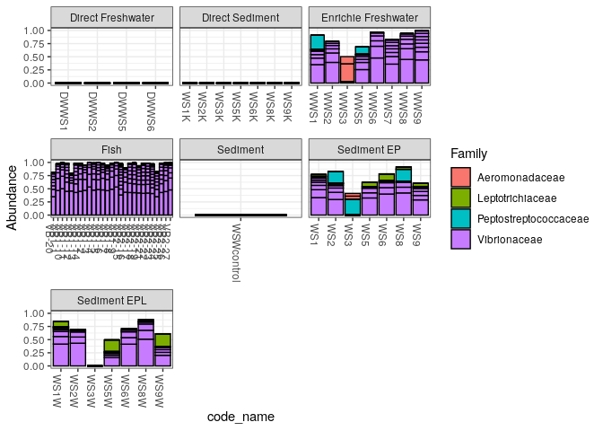<!-- --> \#Au
niveau des familles, il n’y a aucun résultat pour les échantillons
directs d’eau et de sédiments, le classifieur n’est pas allé plus loin
que le domaine. \#Les procaryotes issus des sédiments enrichis à l’eau
peptonée semblent être en grande majorité des Vibrionacea Sauf pour WS3
qui est dominée par les Peptostreptococcaceae. Pour les sédiments
suplémentés en eau du lac on remarque aussi une dominance des
Vibrionacea avec en plus faible abondance des Leptotrichiaceae. Ce
résultat ne concorde pas avec ceux énoncé dans l’article puisqu’il y
avait bien des bactéries de cette famille présente mais en faible
abondance, à la place les Bacillacea était la deuxième famille la plus
abondante. \#concernant l’eau du Lac enrichie on remarque ausi une
abondance des Vibrionaceae ainsi que des aeromonadaceae (en particulier
pour WWS3) et en plus faible abondance des Peptostreptococcaceae. Ces
résultas sont en accord avec ceux obtenus par les auteurs. \#Enfin, pour
les échantillons de bactéries présentes sur les poissons notre analyse
montre la présence de Vibrionaceae uniquement. Dans notre article il est
indiqué qu’il y à également d’autres familles présentes mais celles-ci
étant en très faible quantités elles n’apparaissent suremet pas sur la
figure ci-dessus.

\#CCA

``` r
library(vegan)
```

    ## Loading required package: permute

    ## 
    ## Attaching package: 'permute'

    ## The following object is masked from 'package:devtools':
    ## 
    ##     check

    ## This is vegan 2.6-4

    ## 
    ## Attaching package: 'vegan'

    ## The following object is masked from 'package:pls':
    ## 
    ##     scores

    ## The following object is masked from 'package:caret':
    ## 
    ##     tolerance

    ## The following objects are masked from 'package:phangorn':
    ## 
    ##     diversity, treedist

``` r
library(labdsv)
```

    ## Loading required package: mgcv

    ## Loading required package: nlme

    ## 
    ## Attaching package: 'nlme'

    ## The following object is masked from 'package:dplyr':
    ## 
    ##     collapse

    ## The following object is masked from 'package:Biostrings':
    ## 
    ##     collapse

    ## The following object is masked from 'package:IRanges':
    ## 
    ##     collapse

    ## This is mgcv 1.8-41. For overview type 'help("mgcv-package")'.

    ## Registered S3 method overwritten by 'labdsv':
    ##   method       from
    ##   summary.dist ade4

    ## This is labdsv 2.0-1
    ## convert existing ordinations with as.dsvord()

    ## 
    ## Attaching package: 'labdsv'

    ## The following object is masked from 'package:randomForest':
    ## 
    ##     importance

    ## The following object is masked from 'package:BiocGenerics':
    ## 
    ##     density

    ## The following object is masked from 'package:stats':
    ## 
    ##     density

\#fabriquer une dataframe avec toutes nos variables physico-chimiques

``` r
vecteur1 <- pH ; vecteur2 <- Oxygen; vecteur3 <- Temperature; vecteur4<-code_name
data_Var<- data.frame(x = vecteur1, y = vecteur2, z= vecteur3, a= vecteur4) 

colnames(data_Var)<- c("pH","Oxygen","Temperature","code_names")
```

\#trouver comment faire le varespec, doit avoir une valeur numérique

``` r
DCA <- decorana (seqtabAll)
DCA
```

    ## 
    ## Call:
    ## decorana(veg = seqtabAll) 
    ## 
    ## Detrended correspondence analysis with 26 segments.
    ## Rescaling of axes with 4 iterations.
    ## Total inertia (scaled Chi-square): 20.2768 
    ## 
    ##                       DCA1  DCA2  DCA3   DCA4
    ## Eigenvalues          1.000 1.000 1.000 0.9994
    ## Additive Eigenvalues 1.000 1.000 1.000 0.9994
    ## Decorana values      1.000 1.000 1.000 0.9994
    ## Axis lengths         1.034 1.474 1.374 1.1971

# Function metaMDS is a wrapper to perform non-metric multidimensional scaling

``` r
ord <- metaMDS(seqtabAll)
```

    ## Square root transformation
    ## Wisconsin double standardization
    ## Run 0 stress 9.908358e-05 
    ## Run 1 stress 0.004563404 
    ## Run 2 stress 0.001212929 
    ## Run 3 stress 0.004294174 
    ## Run 4 stress 0.003244412 
    ## Run 5 stress 0.002948644 
    ## Run 6 stress 0.001250749 
    ## Run 7 stress 0.0009725408 
    ## Run 8 stress 0.001253535 
    ## Run 9 stress 0.004638973 
    ## Run 10 stress 0.004939436 
    ## Run 11 stress 0.001827776 
    ## Run 12 stress 0.002134167 
    ## Run 13 stress 0.001237835 
    ## Run 14 stress 0.002486061 
    ## Run 15 stress 0.003755979 
    ## Run 16 stress 0.00215493 
    ## Run 17 stress 0.002345495 
    ## Run 18 stress 0.002548454 
    ## Run 19 stress 0.004290306 
    ## Run 20 stress 0.001561156 
    ## *** Best solution was not repeated -- monoMDS stopping criteria:
    ##     20: no. of iterations >= maxit

    ## Warning in metaMDS(seqtabAll): stress is (nearly) zero: you may have
    ## insufficient data

\#intégrer variables environementales

``` r
ord.fit <- envfit(ord ~ pH + Oxygen+ Temperature, data=data_Var, perm=999)
ord.fit
```

    ## 
    ## ***FACTORS:
    ## 
    ## Centroids:
    ##                    NMDS1     NMDS2
    ## pH?            -2521.754   -53.624
    ## pH7.90          2302.102   583.017
    ## pH9.38          4306.493  -245.411
    ## pH9.55          -308.050  -154.419
    ## pH9.56          -617.998  -109.274
    ## pH9.57          2618.289   907.369
    ## Oxygen?        -2521.754   -53.624
    ## Oxygen3.9       1759.466  -181.855
    ## Oxygen4        -1218.870   -38.095
    ## Oxygen4.1       3261.393  -450.751
    ## Oxygen4.2       2477.762   763.212
    ## Temperature?   -2521.754   -53.624
    ## Temperature4.7 -2519.447   -50.733
    ## Temperature5.5  1426.568  -555.596
    ## Temperature6.1  -909.084   -34.973
    ## Temperature6.4  1759.466  -181.855
    ## Temperature7.8  4306.493  -245.411
    ## Temperature8.1  2302.102   583.017
    ## Temperature9.2  2618.289   907.369
    ## 
    ## Goodness of fit:
    ##                 r2 Pr(>r)  
    ## pH          0.1260  0.145  
    ## Oxygen      0.1576  0.040 *
    ## Temperature 0.1594  0.179  
    ## ---
    ## Signif. codes:  0 '***' 0.001 '**' 0.01 '*' 0.05 '.' 0.1 ' ' 1
    ## Permutation: free
    ## Number of permutations: 999

``` r
plot(ord, dis="site")
plot(ord.fit, type = "ordiarrows")
```

    ## Warning in text.default(x$factors$centroids[, choices, drop = FALSE], labs$f, :
    ## graphical parameter "type" is obsolete

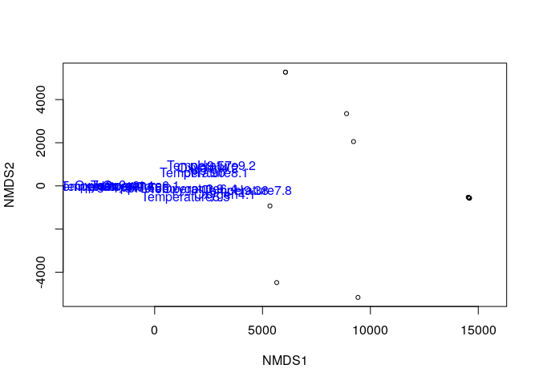<!-- -->

\#faire une CCA en fonction des 3 vecteurs : pH, Oxygen, Température

``` r
ordCCA <- cca(seqtabAll ~ pH + Oxygen +Temperature, data=data_Var)
ordCCA
```

    ## Call: cca(formula = seqtabAll ~ pH + Oxygen + Temperature, data =
    ## data_Var)
    ## 
    ##               Inertia Proportion Rank
    ## Total         20.2768     1.0000     
    ## Constrained    2.6797     0.1322    8
    ## Unconstrained 17.5972     0.8678   52
    ## Inertia is scaled Chi-square 
    ## Some constraints or conditions were aliased because they were redundant
    ## 
    ## Eigenvalues for constrained axes:
    ##   CCA1   CCA2   CCA3   CCA4   CCA5   CCA6   CCA7   CCA8 
    ## 0.9009 0.4610 0.3855 0.2723 0.2352 0.1794 0.1378 0.1074 
    ## 
    ## Eigenvalues for unconstrained axes:
    ##    CA1    CA2    CA3    CA4    CA5    CA6    CA7    CA8 
    ## 1.0000 1.0000 1.0000 0.9997 0.9936 0.9911 0.9819 0.9818 
    ## (Showing 8 of 52 unconstrained eigenvalues)

``` r
plot(ordCCA)
points(ordCCA, display = 'sites', col(data_Var, as.factor=TRUE), pch=".",)
ordiarrows(ordCCA, Oxygen, display = "sites", label=TRUE) 
```

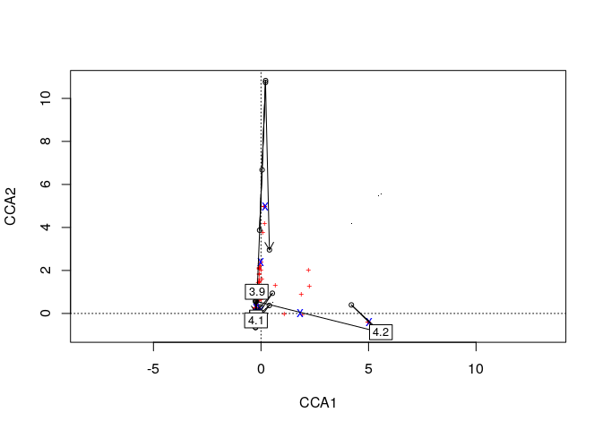<!-- --> \#rond
noirs = échantillons, croix rouges = ASV

\#pour la CCA il aurai fallu obtenir 3 axes distinct avec pH,
Température et Oxygène mais je n’arrive à afficher que plusieurs axes
concernant l’une des 3 variables à la fois (ici Oxygène)

\#cependant, grâce aux PCoA on peut remarquer que la biodiversité
présente dans les sédiments d’eau semble influencée par le pH (sortout
les échantillons d’eau directs) uniquement. Les procaryotes issus de
l’eau enrichie et les sédiments sont quant à eux influencés par le pH
mais aussi la concentration d’oxygène dissoud. La Température ne semblre
cependant pas avoir d’effet notable. Aucune corrélation entre ces
paramètres physico-chimiques et les autres échantillons n’est observée.
